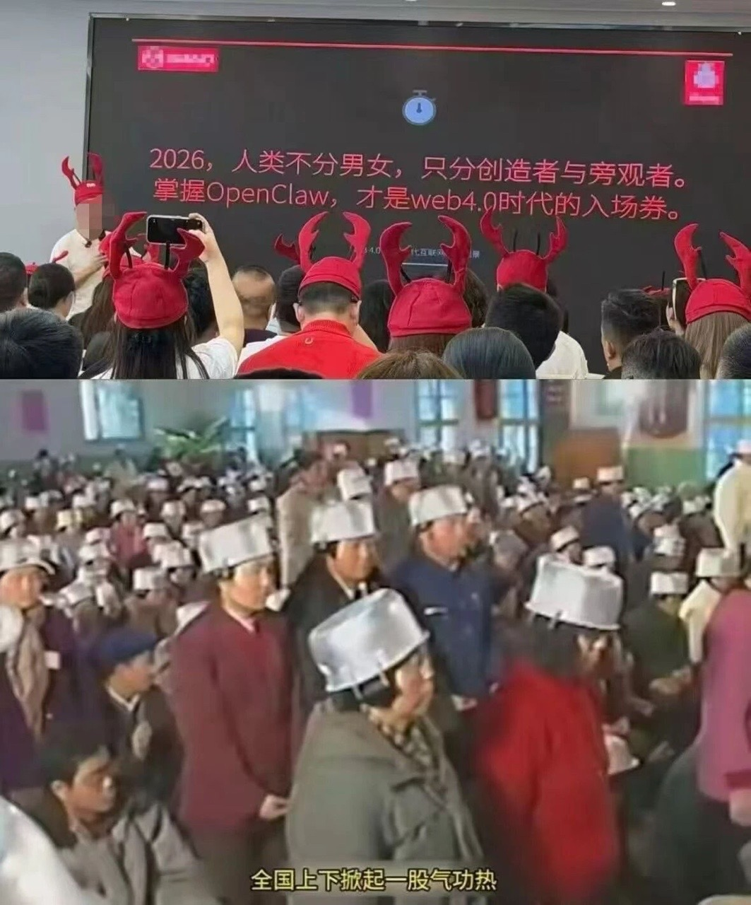

# 掌握 OpenClaw 才是 Web4.0 的入场券？你养虾了吗？还是练气功？

> 当别人还在讨论 AI 会不会取代人类时，聪明人已经开始用 AI 给自己雇了 77 个员工。

---

## 一、Web4.0 来了，你准备好了吗？

Web1.0：你只能看  
Web2.0：你可以发  
Web3.0：你可以拥有  
Web4.0：**你可以指挥**

什么是 Web4.0？不是区块链，不是元宇宙，而是**AI 原生工作流**——你不再是操作工具的人，而是指挥智能体干活的老板。

而 OpenClaw，就是这个时代的"操作系统"。

---

## 二、OpenClaw 是什么？

简单说，OpenClaw 是一个**AI 智能体编排平台**。它让你能够：

- 📋 **任务管理**：拆解大活儿、安排小活儿、跟踪进度
- 🤖 **Agent 调度**：协调 dev/writer/moneymaker 干活，把控质量
- 🔧 **工具调用**：文件读写、命令执行、定时任务、消息发送
- 🎭 **角色扮演**：77 个专业角色随时待命，从项目管理到技术开发

**你不是在学习一个新工具，你是在组建一支 AI 团队。**

---

## 三、"养虾"还是"练气功"？

最近圈子里有两个梗：

**"养虾"** = 折腾各种零散的 AI 工具，今天用这个明天换那个，像养虾一样需要精心照料但产出有限

**"练气功"** = 构建系统化的 AI 工作流，让智能体自动运转，像练内功一样越积越厚

你选哪个？

OpenClaw 的答案是：**别养虾了，练气功吧。**

---

## 四、为什么是 OpenClaw？

### 1. 真正的"一人公司"

77 个岗位，0 个员工，创造 100 人的价值。

- Frontend Developer 写代码
- UX Researcher 做调研
- Growth Hacker 设计增长实验
- DevOps Automator 配置 CI/CD

**你只需要下指令，剩下的交给他们。**

### 2. 记忆与连续性

每次对话不再是"失忆重启"。OpenClaw 有：

- **MEMORY.md**：你的长期记忆库
- **SOUL.md**：你的 AI 助理的人格设定
- **HEARTBEAT.md**：主动检查邮件、日历、通知

**它记得你说过的话，记得你们的约定，记得该提醒你什么。**

### 3. 安全与边界

- 私有数据不出域
- 敏感操作需确认
- 群聊不泄露隐私

**它是你的助理，不是你的风险。**

---

## 五、入场券，还是门票？

有人说 OpenClaw 是 Web4.0 的入场券。

我说不对。**入场券是你买了就能进的，但 OpenClaw 是你买了还得练的。**

它不是魔法棒，它是功夫秘籍。

- 你越会用，它越强
- 你越信任，它越靠谱
- 你越放手，它越独立

**最终，你不是在"使用"OpenClaw，你是在"培养"一个越来越能干的数字分身。**

---

## 六、所以，你练气功了吗？

如果：

- ✅ 你还在手动查邮件、回消息、记待办
- ✅ 你还在为"哪个 AI 工具更好用"纠结
- ✅ 你还在担心"AI 会不会取代我"

那你可能还在"养虾"。

如果：

- ✅ 你有 AI 助理帮你处理日常杂事
- ✅ 你有智能体团队帮你完成项目
- ✅ 你在思考"如何让 AI 更懂我"

那你已经在"练气功"了。

---

## 结语

Web4.0 的入场券，不是一张票。

**是一套功夫，一支团队，一个越来越像你的数字分身。**

OpenClaw 已经准备好了。

你，准备好了吗？

---

*本文由"万能小秘书"撰写，基于 OpenClaw 智能体协作完成。*  
*配图：用户供图*

